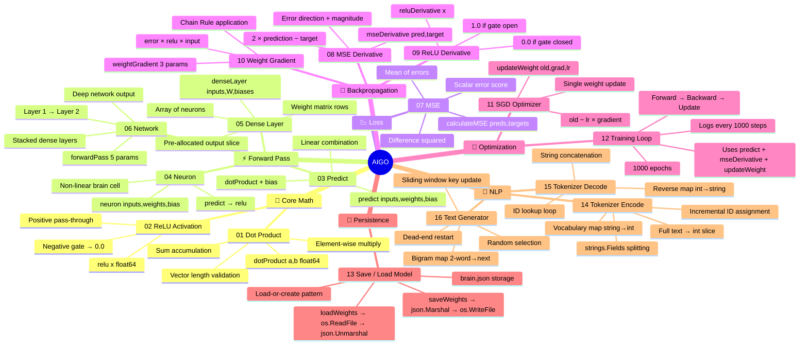
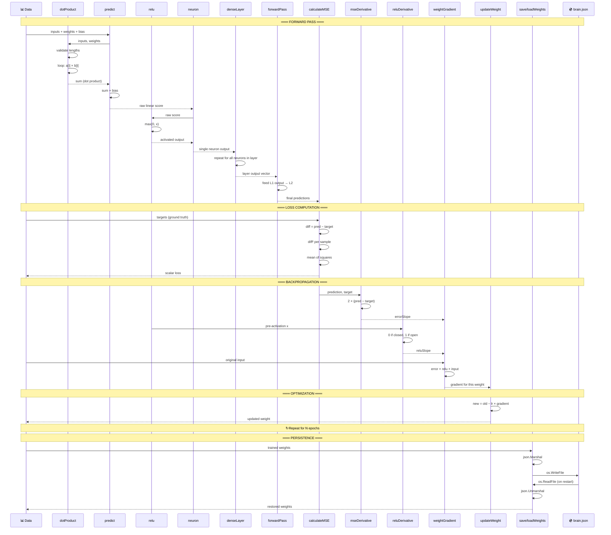
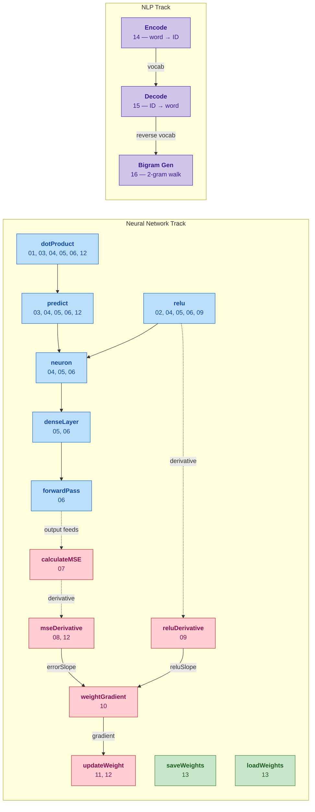

# AIGO — Complete Codebase Architecture

> 16 standalone Go lessons building a neural network from scratch — zero dependencies.

---

## 1. Detailed Architecture (Step-by-Step Breakdown)

```mermaid
graph TB
    subgraph PHASE1["🧮 Phase 1 — Core Math Primitives"]
        direction TB
        L01["<b>01 · Dot Product</b>"]
        L01_1["Validate vector lengths match"]
        L01_2["Loop: multiply element pairs"]
        L01_3["Accumulate sum → return"]
        L01 --> L01_1 --> L01_2 --> L01_3

        L02["<b>02 · ReLU Activation</b>"]
        L02_1["Input x received"]
        L02_2{"x < 0 ?"}
        L02_3["Return 0.0"]
        L02_4["Return x unchanged"]
        L02 --> L02_1 --> L02_2
        L02_2 -->|yes| L02_3
        L02_2 -->|no| L02_4
    end

    subgraph PHASE2["⚡ Phase 2 — Forward Pass Pipeline"]
        direction TB
        L03["<b>03 · Predict</b>"]
        L03_1["Receive inputs, weights, bias"]
        L03_2["Call dotProduct on inputs × weights"]
        L03_3["Add bias to result"]
        L03 --> L03_1 --> L03_2 --> L03_3

        L04["<b>04 · Neuron</b>"]
        L04_1["Call predict to get raw linear score"]
        L04_2["Pass raw score through relu"]
        L04_3["Return activated output"]
        L04 --> L04_1 --> L04_2 --> L04_3

        L05["<b>05 · Dense Layer</b>"]
        L05_1["Allocate output slice: make float64, N"]
        L05_2["Loop over each neuron row in weight matrix"]
        L05_3["Call neuron per row with shared inputs"]
        L05_4["Collect all outputs → return slice"]
        L05 --> L05_1 --> L05_2 --> L05_3 --> L05_4

        L06["<b>06 · Network Forward Pass</b>"]
        L06_1["Feed raw inputs into Layer 1"]
        L06_2["denseLayer produces L1 outputs"]
        L06_3["Feed L1 outputs into Layer 2"]
        L06_4["denseLayer produces final outputs"]
        L06 --> L06_1 --> L06_2 --> L06_3 --> L06_4
    end

    subgraph PHASE3["📉 Phase 3 — Error Measurement"]
        direction TB
        L07["<b>07 · MSE Loss</b>"]
        L07_1["Validate prediction/target lengths match"]
        L07_2["Loop: diff = pred_i − target_i"]
        L07_3["Square each diff: diff × diff"]
        L07_4["Accumulate sum of squares"]
        L07_5["Divide by count → Mean Squared Error"]
        L07 --> L07_1 --> L07_2 --> L07_3 --> L07_4 --> L07_5
    end

    subgraph PHASE4["🔄 Phase 4 — Backpropagation"]
        direction TB
        L08["<b>08 · MSE Derivative</b>"]
        L08_1["Receive single prediction + target"]
        L08_2["Compute: 2.0 × prediction − target"]
        L08_3["Return error slope direction + magnitude"]
        L08 --> L08_1 --> L08_2 --> L08_3

        L09["<b>09 · ReLU Derivative</b>"]
        L09_1["Receive pre-activation value x"]
        L09_2{"x ≤ 0 ?"}
        L09_3["Return 0.0 — gate was closed"]
        L09_4["Return 1.0 — gate was open"]
        L09 --> L09_1 --> L09_2
        L09_2 -->|yes| L09_3
        L09_2 -->|no| L09_4

        L10["<b>10 · Weight Gradient</b>"]
        L10_1["Receive errorSlope, reluSlope, input"]
        L10_2["Chain Rule: error × relu × input"]
        L10_3["Return final gradient for this weight"]
        L10 --> L10_1 --> L10_2 --> L10_3
    end

    subgraph PHASE5["🎯 Phase 5 — Optimization"]
        direction TB
        L11["<b>11 · SGD Optimizer</b>"]
        L11_1["Receive oldWeight, gradient, learningRate"]
        L11_2["new = old − learningRate × gradient"]
        L11_3["Return updated weight"]
        L11 --> L11_1 --> L11_2 --> L11_3

        L12["<b>12 · Training Loop</b>"]
        L12_1["Initialize weights, bias, lr, epochs"]
        L12_2["LOOP: epoch 0 → N"]
        L12_3["Forward: predict inputs,weights,bias"]
        L12_4["Backward: mseDerivative pred,target"]
        L12_5["For each weight: compute gradient"]
        L12_6["Update: updateWeight old,grad,lr"]
        L12_7["Log progress every 1000 epochs"]
        L12 --> L12_1 --> L12_2 --> L12_3 --> L12_4 --> L12_5 --> L12_6 --> L12_7
        L12_7 -->|"next epoch"| L12_2
    end

    subgraph PHASE6["💾 Phase 6 — Persistence"]
        direction TB
        L13["<b>13 · Save / Load Model</b>"]
        L13_LOAD["loadWeights filename"]
        L13_L1["os.ReadFile → raw bytes"]
        L13_L2["json.Unmarshal → float64 slice"]
        L13_L3{"File exists?"}
        L13_SAVE["saveWeights weights, filename"]
        L13_S1["json.Marshal → JSON bytes"]
        L13_S2["os.WriteFile → brain.json"]
        L13 --> L13_L3
        L13_L3 -->|yes| L13_LOAD --> L13_L1 --> L13_L2
        L13_L3 -->|no| L13_SAVE
        L13_L2 --> L13_SAVE --> L13_S1 --> L13_S2
        BRAIN[("💿 brain.json")]
        L13_S2 --> BRAIN
    end

    subgraph PHASE7["📝 Phase 7 — NLP / Text"]
        direction TB
        L14["<b>14 · Tokenizer Encode</b>"]
        L14_1["Split text into words via strings.Fields"]
        L14_2["Build vocab: map string → int"]
        L14_3["Assign incremental IDs to new words"]
        L14_4["Encode full text → int slice"]
        L14 --> L14_1 --> L14_2 --> L14_3 --> L14_4

        L15["<b>15 · Tokenizer Decode</b>"]
        L15_1["Build reverse vocab: map int → string"]
        L15_2["Loop over encoded IDs"]
        L15_3["Lookup each ID → word"]
        L15_4["Concatenate → output string"]
        L15 --> L15_1 --> L15_2 --> L15_3 --> L15_4

        L16["<b>16 · Bigram Text Generator</b>"]
        L16_1["Build bigram brain: map 2-word-key → next words"]
        L16_2["Pick starting 2-word key"]
        L16_3["Lookup key in brain"]
        L16_4{"Choices found?"}
        L16_5["Random pick from choices"]
        L16_6["Dead end → pick random restart key"]
        L16_7["Slide window: drop first word, append next"]
        L16 --> L16_1 --> L16_2 --> L16_3 --> L16_4
        L16_4 -->|yes| L16_5 --> L16_7
        L16_4 -->|no| L16_6 --> L16_7
        L16_7 -->|"repeat 10×"| L16_3
    end

    %% ── Cross-phase flow ──
    L01_3 -->|"dotProduct"| L03_2
    L02_4 -->|"relu"| L04_2
    L03_3 -->|"predict"| L04_1
    L04_3 -->|"neuron"| L05_3
    L05_4 -->|"denseLayer"| L06_1
    L06_4 -->|"predictions"| L07_1
    L07_5 -->|"loss"| L08_1
    L08_3 -->|"errorSlope"| L10_1
    L09_4 -->|"reluSlope"| L10_1
    L10_3 -->|"gradient"| L11_1
    L11_3 -->|"updateWeight"| L12_6
    L12_6 -->|"trained weights"| L13_SAVE
    L14_4 -->|"encoded IDs"| L15_2
    L15_4 -->|"vocab"| L16_1

    %% ── Colors ──
    classDef math fill:#e3f2fd,stroke:#1565c0,color:#0d47a1
    classDef fwd fill:#e8f5e9,stroke:#2e7d32,color:#1b5e20
    classDef loss fill:#fff8e1,stroke:#f9a825,color:#e65100
    classDef back fill:#fce4ec,stroke:#c62828,color:#880e4f
    classDef opt fill:#f3e5f5,stroke:#7b1fa2,color:#4a148c
    classDef persist fill:#e0f2f1,stroke:#00695c,color:#004d40
    classDef nlp fill:#ede7f6,stroke:#4527a0,color:#311b92
    classDef decision fill:#fff9c4,stroke:#f9a825,color:#e65100
    classDef data fill:#ffecb3,stroke:#ff8f00,color:#e65100

    class L01,L01_1,L01_2,L01_3,L02,L02_1,L02_3,L02_4 math
    class L03,L03_1,L03_2,L03_3,L04,L04_1,L04_2,L04_3,L05,L05_1,L05_2,L05_3,L05_4,L06,L06_1,L06_2,L06_3,L06_4 fwd
    class L07,L07_1,L07_2,L07_3,L07_4,L07_5 loss
    class L08,L08_1,L08_2,L08_3,L09,L09_1,L09_3,L09_4,L10,L10_1,L10_2,L10_3 back
    class L11,L11_1,L11_2,L11_3,L12,L12_1,L12_2,L12_3,L12_4,L12_5,L12_6,L12_7 opt
    class L13,L13_LOAD,L13_L1,L13_L2,L13_SAVE,L13_S1,L13_S2 persist
    class L14,L14_1,L14_2,L14_3,L14_4,L15,L15_1,L15_2,L15_3,L15_4,L16,L16_1,L16_2,L16_3,L16_5,L16_6,L16_7 nlp
    class L02_2,L09_2,L13_L3,L16_4 decision
    class BRAIN data
```

---

## 2. Mindmap

---

## 3. Tree View

```mermaid
graph TD
    ROOT["🧠 AIGO<br/><i>module aigo — Go 1.25.3</i>"]

    ROOT --> D01
    ROOT --> D02
    ROOT --> D03
    ROOT --> D04
    ROOT --> D05
    ROOT --> D06
    ROOT --> D07
    ROOT --> D08
    ROOT --> D09
    ROOT --> D10
    ROOT --> D11
    ROOT --> D12
    ROOT --> D13
    ROOT --> D14
    ROOT --> D15
    ROOT --> D16
    ROOT --> FILES

    D01["📂 01_dot_product/"]
    D01 --> D01F["main.go — 30 lines"]
    D01F --> D01F1["func dotProduct a,b → float64"]
    D01F --> D01F2["func main — demo with 3D vectors"]

    D02["📂 02_activation/"]
    D02 --> D02F["main.go — 19 lines"]
    D02F --> D02F1["func relu x → float64"]
    D02F --> D02F2["func main — test relu 0.23"]

    D03["📂 03_predict/"]
    D03 --> D03F["main.go — 41 lines"]
    D03F --> D03F1["func dotProduct"]
    D03F --> D03F2["func predict in,w,b → float64"]
    D03F --> D03F3["func main — house price example"]

    D04["📂 04_neuron/"]
    D04 --> D04F["main.go — 53 lines"]
    D04F --> D04F1["func dotProduct"]
    D04F --> D04F2["func predict"]
    D04F --> D04F3["func relu"]
    D04F --> D04F4["func neuron in,w,b → float64"]
    D04F --> D04F5["func main — negative score demo"]

    D05["📂 05_layer/"]
    D05 --> D05F["main.go — 69 lines"]
    D05F --> D05F1["func dotProduct"]
    D05F --> D05F2["func predict"]
    D05F --> D05F3["func relu"]
    D05F --> D05F4["func neuron"]
    D05F --> D05F5["func denseLayer in,W,b → float64 slice"]
    D05F --> D05F6["func main — 3 neuron layer"]

    D06["📂 06_network/"]
    D06 --> D06F["main.go — 80 lines"]
    D06F --> D06F1["func dotProduct"]
    D06F --> D06F2["func predict"]
    D06F --> D06F3["func relu"]
    D06F --> D06F4["func neuron"]
    D06F --> D06F5["func denseLayer"]
    D06F --> D06F6["func forwardPass 5 params → float64 slice"]
    D06F --> D06F7["func main — 2-layer deep network"]

    D07["📂 07_loss/"]
    D07 --> D07F["main.go — 45 lines"]
    D07F --> D07F1["func calculateMSE preds,tgts → float64"]
    D07F --> D07F2["func main — 3 house price errors"]

    D08["📂 08_backprop/"]
    D08 --> D08F["main.go — 29 lines"]
    D08F --> D08F1["func mseDerivative pred,tgt → float64"]
    D08F --> D08F2["func main — slope of mistake"]

    D09["📂 09_derivatives/"]
    D09 --> D09F["main.go — 40 lines"]
    D09F --> D09F1["func relu"]
    D09F --> D09F2["func reluDerivative x → float64"]
    D09F --> D09F3["func main — test slopes at -5 and 10.2"]

    D10["📂 10_gradients/"]
    D10 --> D10F["main.go — 38 lines"]
    D10F --> D10F1["func weightGradient err,relu,in → float64"]
    D10F --> D10F2["func main — chain rule demo"]

    D11["📂 11_optimizer/"]
    D11 --> D11F["main.go — 36 lines"]
    D11F --> D11F1["func updateWeight old,grad,lr → float64"]
    D11F --> D11F2["func main — single SGD step"]

    D12["📂 12_train/"]
    D12 --> D12F["main.go — 73 lines"]
    D12F --> D12F1["func dotProduct"]
    D12F --> D12F2["func predict"]
    D12F --> D12F3["func mseDerivative"]
    D12F --> D12F4["func updateWeight"]
    D12F --> D12F5["func main — 1000 epoch training loop"]

    D13["📂 13_save_model/"]
    D13 --> D13F["main.go — 73 lines"]
    D13 --> D13B["brain.json — model weights"]
    D13F --> D13F1["func saveWeights w,file"]
    D13F --> D13F2["func loadWeights file → float64,error"]
    D13F --> D13F3["func main — load-or-create pattern"]

    D14["📂 14_tokenizer_encode/"]
    D14 --> D14F["main.go — 39 lines"]
    D14F --> D14F1["func main — build vocab map, encode text"]

    D15["📂 15_tokenizer_decode/"]
    D15 --> D15F["main.go — 27 lines"]
    D15F --> D15F1["func main — reverse vocab lookup"]

    D16["📂 16_text_generator/"]
    D16 --> D16F["main.go — 54 lines"]
    D16F --> D16F1["func main — bigram model + random walk"]

    FILES["📄 Root Files"]
    FILES --> RF1["go.mod — module aigo, Go 1.25.3"]
    FILES --> RF2["brain.json — saved model weights"]
    FILES --> RF3["README.md — project docs"]
    FILES --> RF4["CHANGELOG.md — change log"]

    %% ── Styling ──
    classDef root fill:#1a237e,stroke:#0d47a1,color:#fff,font-weight:bold
    classDef dir fill:#e3f2fd,stroke:#1565c0,color:#0d47a1
    classDef file fill:#f5f5f5,stroke:#9e9e9e,color:#424242
    classDef func fill:#e8f5e9,stroke:#2e7d32,color:#1b5e20,font-size:11px
    classDef rootfiles fill:#fff8e1,stroke:#f9a825,color:#e65100

    class ROOT root
    class D01,D02,D03,D04,D05,D06,D07,D08,D09,D10,D11,D12,D13,D14,D15,D16 dir
    class D01F,D02F,D03F,D04F,D05F,D06F,D07F,D08F,D09F,D10F,D11F,D12F,D13F,D13B,D14F,D15F,D16F file
    class D01F1,D01F2,D02F1,D02F2,D03F1,D03F2,D03F3,D04F1,D04F2,D04F3,D04F4,D04F5,D05F1,D05F2,D05F3,D05F4,D05F5,D05F6,D06F1,D06F2,D06F3,D06F4,D06F5,D06F6,D06F7,D07F1,D07F2,D08F1,D08F2,D09F1,D09F2,D09F3,D10F1,D10F2,D11F1,D11F2,D12F1,D12F2,D12F3,D12F4,D12F5,D13F1,D13F2,D13F3,D14F1,D15F1,D16F1 func
    class FILES,RF1,RF2,RF3,RF4 rootfiles
```

---

## 4. Data Flow (Full Training Cycle)

---

## 5. Function Dependency Graph

